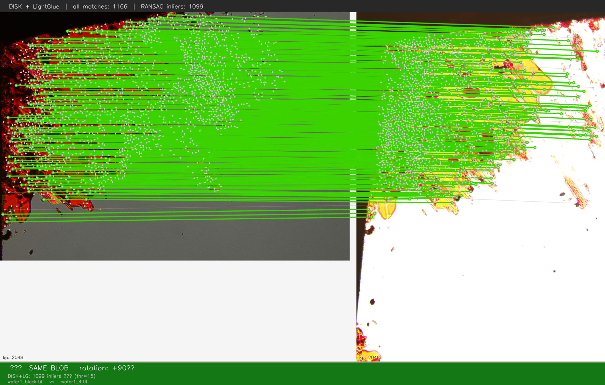
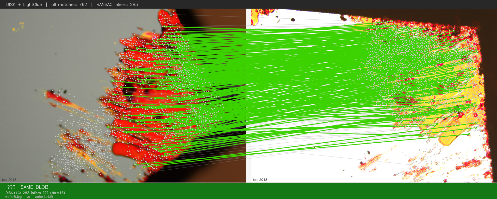

# WhatTheWafer

<table border="0"><tr>
<td></td>
<td align="center"><strong>SILICON WAFER IDENTIFICATION BY UNIQUE BLOB FINGERPRINT</strong></td>
</tr></table>

Each silicon wafer carries a unique feature: a marker blob in the corner with a distinctive pattern of interference fringes. The system memorises this "digital fingerprint" and stores it in a database. From a single new image it determines which wafer it is and what is recorded about it.

```
whattw query wafer_photo.jpg

  Rank  Blob ID                   Inliers    Rotation
  ──────────────────────────────────────────────────
  1     sample_42                      87          0°  ◀
  2     sample_07                       6        +90°
  3     sample_15                       3          0°

[✓] MATCH → 'sample_42'  (87 inliers)
```

---

## How it works

The system does not retrain when new wafers are added. It uses two frozen pretrained models:

- **DISK** — detects up to 2048 distinctive keypoints per image, ranked by confidence
- **LightGlue** — matches keypoints between two images using a graph attention network

When a wafer is added (`add`), the models extract a fingerprint once and store it. On a query (`query`), a FAISS index narrows the database down to the 5 most similar candidates; LightGlue then scores each with RANSAC geometric verification. The candidate with the most inliers wins.

The system automatically tries all 4 × 90° rotations — if the wafer was photographed at a different orientation it is not a problem.

---

## Examples

**Same wafer photographed in bright-field and dark-field mode** — the blob pattern is clearly matched despite the inverted contrast:



**Same wafer photographed at different angles** — the system finds the correct orientation automatically:



Green lines connect geometrically verified keypoint pairs (RANSAC inliers). Grey lines show all LightGlue matches before verification.

---

## Installation

**Requirements:** Python 3.10+, pip

```bash
cd WhatTheWafer

# Install dependencies and register the whattw command
pip install -e .
```

An NVIDIA GPU will be used automatically if available. The system also runs on CPU, but significantly slower.

> See [QUICKSTART.md](QUICKSTART.md) for a quick getting-started guide.

---

## Quick start

### Step 1 — Add reference images

Photograph each wafer 2–4 times (different angles, lighting) and add them to the database.  
You can pass multiple images in a single command — the index is rebuilt only once:

```bash
# Create a new wafer entry with several views at once
whattw add photo1.tif photo2.tif photo3.tif --new sample_42

# Or add individual images one at a time
whattw add other.tif --new sample_07
whattw add other2.tif --wafer sample_07   # second view of the same wafer
```

Accepted formats: **TIF (16-bit, OME), JPEG, PNG, BMP**.

### Step 2 — Identify an unknown image

```bash
whattw query unknown.jpg
```

### Step 3 — Visually verify the match

```bash
whattw compare reference.tif unknown.jpg --output result.png
```

Saves a side-by-side image with all LightGlue matches (grey) and RANSAC inliers (green).

---

## All commands

### `add` — add a wafer to the database

```bash
whattw add <image> [<image> ...] --new <name>          # create a new wafer
whattw add <image> [<image> ...] --wafer <name|uuid>   # add views to existing wafer
```

| Flag | Description |
|---|---|
| `--new NAME` | Create a new wafer with this identifier, e.g. `sample_42` |
| `--wafer NAME\|UUID` | Wafer name or 4-char UUID to add new views to |
| `--force` | Skip duplicate-detection warning |

Multiple image paths are accepted — FAISS is rebuilt only once after all images are added.

### `query` — identify an image

```bash
whattw query <image>
```

| Flag | Description |
|---|---|
| `--top-k N` | Show N best matches (default: 5) |
| `--threshold N` | Minimum inlier count for a positive match (default: 15) |
| `--fine-rotation` | Extra ±5/10/15° search around the best 90°-step rotation |
| `--debug` | Print per-image match scores |

### `compare` — visually compare two images

```bash
whattw compare <image1> <image2> --output result.png
```

| Flag | Description |
|---|---|
| `--output`, `-o` | Output PNG path (default: `compare_result.png`) |
| `--fine-rotation` | Fine rotation search around the best cardinal angle |

### `list` — list all wafers in the database

```bash
whattw list
```

### `clear` — remove from the database

```bash
whattw clear --wafer sample_42            # remove one wafer (by name or UUID)
whattw clear --wafer sample_42 --image 1  # remove a single view (index from list)
whattw clear --all                        # wipe the entire database
```

| Flag | Description |
|---|---|
| `--wafer NAME\|UUID` | Wafer to remove |
| `--image N` | Index of the view to remove (use with `--wafer`) |
| `--all` | Clear the entire database |
| `--yes`, `-y` | Skip confirmation prompt |

### Global flag `--no-gpu`

```bash
whattw --no-gpu query unknown.jpg
```

Forces CPU inference even if a GPU is available.

---

## Tips

| Situation | Recommendation |
|---|---|
| Dark-field imaging | Add at least one dark-field image of the same wafer as a reference |
| Very close-up frame | Add a close-up shot as an additional view |
| Image slightly tilted (< 15°) | Use `--fine-rotation` |
| Wafer not found | Run with `--debug` to see per-reference inlier counts |
| False duplicate warning on `add` | Use `--force` to add anyway |

**How many reference images are needed?**  
Minimum 1, optimal 2–4. Add images under varied conditions — lighting, scale, orientation. The more diverse the references, the more robust the identification.

---

## How the models work

### DISK — keypoint detector and descriptor

DISK (Deep Image local featureS with Keypoints) is a convolutional neural network trained end-to-end to simultaneously detect interest points and compute their descriptors. Unlike classical detectors such as SIFT or ORB — which use hand-crafted gradients and heuristics — DISK is trained directly to maximise the number of geometrically correct matches between image pairs.

The architecture is based on a U-Net-style encoder-decoder: the encoder compresses the image into a compact feature map, and the decoder upsamples it back to the original resolution, producing for each pixel both a detection probability and a 128-dimensional descriptor vector. During training, pairs of images with known relative geometry are used. Keypoints that can be successfully matched earn a reward; keypoints that cannot be matched are penalised. This reward signal propagates back through RANSAC (using a differentiable approximation) so the network learns not just "where to look" but "which points will survive geometric verification."

The `depth` pretrained weights used here were trained on the MegaDepth dataset — a large collection of outdoor and indoor scene reconstructions from internet photos. Despite being trained on natural scenes, the features generalise well to microscopy images because interference fringe patterns create rich, high-contrast local texture that the network finds easy to detect and describe reliably.

At inference, DISK returns up to 2048 keypoints per image, ranked by detection confidence. Only the top-scoring points are kept, which provides a good balance between speed and coverage.

### LightGlue — keypoint matcher

LightGlue is a graph neural network that takes two sets of keypoints with their descriptors and returns a sparse set of correspondences. It was designed as a lightweight successor to SuperGlue, with a focus on efficiency without sacrificing accuracy.

The matching is performed iteratively through a stack of transformer layers. Each layer consists of two phases:
- **Self-attention** — each keypoint attends to all other keypoints in the *same* image, building a richer geometric context (e.g., learning that certain spatial arrangements are reliable anchors).
- **Cross-attention** — each keypoint attends to all keypoints in the *other* image, gradually building confidence about which point it should be matched to.

A key design feature of LightGlue is **adaptive depth**: the network can stop processing for individual keypoint pairs as soon as it is confident enough about the assignment, rather than running all layers for all pairs unconditionally. This makes inference significantly faster when there are many easy matches — which is typical for repeated views of the same wafer.

LightGlue was trained specifically to work with DISK descriptors (as well as SuperPoint), which means the two models form a matched pair optimised jointly. The output is a list of matched index pairs, which are then passed to RANSAC for geometric consistency filtering.

### Why RANSAC on top of LightGlue?

LightGlue already incorporates geometric reasoning through attention, but it can still produce a small number of incorrect correspondences. RANSAC (Random Sample Consensus) fits a homography model to the proposed matches and classifies each as inlier or outlier based on reprojection error. The inlier count is the final match score used for identification. This two-stage approach (neural matching → classical geometric verification) is robust to illumination changes, partial occlusion, and optical distortions typical in microscopy.

### Is fine-tuning required?

**No.** Both DISK and LightGlue are used in a completely frozen, zero-shot manner — no additional training is performed when new wafers are added to the database.

This works because:
- **DISK** was trained on a diverse large-scale dataset and learns general-purpose features that transfer to new domains without adaptation. Interference fringe patterns produce distinctive local structure that DISK detects and describes reliably out of the box.
- **LightGlue** was trained on image pairs with known geometric transformations and learns to reason about geometric consistency, which applies directly to the wafer identification task.
- **RANSAC** provides a final hard geometric filter that is completely parameter-free and domain-agnostic.

The only domain-specific component in the pipeline is the preprocessing step (blob segmentation, crop, resize), which is classical computer vision and requires no training. Adding a new wafer is purely a forward-pass operation: extract features once, store them. There is no gradient computation, no weight update, no training loop.

Fine-tuning DISK or LightGlue on wafer images could in principle squeeze out a few more inliers on difficult cases, but it would require curated paired training data (same wafer, multiple capture conditions with known relative geometry) — which is hard and expensive to obtain — and the current frozen approach already achieves robust identification in practice.

---

## Project structure

```
WhatTheWafer/
├── wafer_id.py          — entry point, CLI
├── preprocessing.py     — image loading and blob segmentation
├── database.py          — storage (SQLite + HDF5 + FAISS)
├── visualizer.py        — match visualization
├── matchers/
│   └── disk_lightglue_matcher.py — DISK + LightGlue matcher
├── models/
│   └── checkpoints/     — model weights (~50 MB, bundled with the project)
├── examples/            — example comparison images
├── database/            — wafer database (created automatically on first add)
├── Dockerfile           — for building a portable image
└── DEPLOY.md            — deployment guide for an offline PC
```

---

## Technical details

| | |
|---|---|
| Models | DISK (depth), LightGlue |
| Keypoints per image | up to 2048 (top-ranked by detection confidence) |
| Storage | SQLite (metadata) + HDF5 float16 (features) + FAISS ScalarQuantizer QT_8bit (fast retrieval) |
| DB size | ~0.8 MB per image |
| Input formats | TIF (16-bit, OME), JPEG, PNG, BMP |
| Query speed | Seconds on GPU regardless of DB size (FAISS pre-filters to 5 candidates) |
| Retraining on `add` | None — models are frozen; `add` only runs forward inference |
